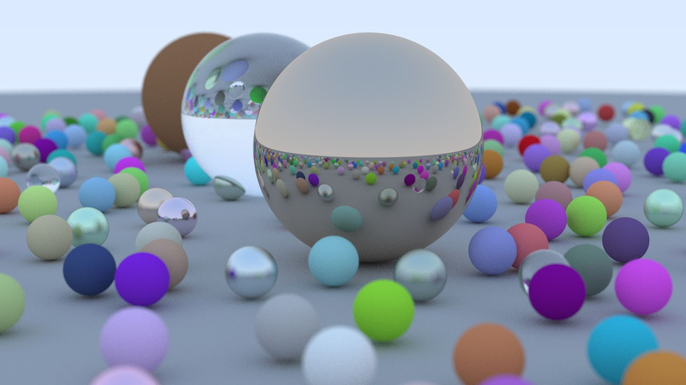

# MRTracer
 :rainbow: Ray Tracer by C++

Miawu's Ray Tracer.



参考：

-  [_Ray Tracing in One Weekend_](https://raytracing.github.io/books/RayTracingInOneWeekend.html)
- GAMES 101

## 运行

- Win10 + MinGW

```sh
git clone https://github.com/miawua/MRTracer.git
cd MRTracer
mkdir build
cd build
cmake -G "MinGW Makefiles" ..
mingw32-make && raytracer.exe && start out.ppm
```

